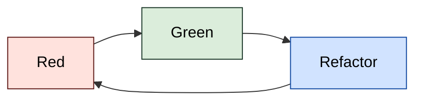

# Kata Workshop

## Build Status (GitHub Actions)

|    Langauge   | Status |  Langauge  | Status |
|:----------:|:------:|:-------:|:------:|
| .NET       | ?      | Go Lang |       |
| JavaScript |       | Python  |       |
| TypeScript |       | Rust    |       |

## Starter Templates
- [.NET Core 6 Starter](https://github.com/dotnetthailand/kata-workshop-dotnet6-starter) - XUnit, FluentAssertions, NSubstitute
- [Go Lang Starter](https://github.com/dotnetthailand/kata-workshop-golang-starter) - Testify
- Other [failing test projects](templates) starter

## Repo Structure
- [templates](templates) - Kata Starter Template (Empty projects for different languages with a failing test), original by [Softwerkskammer](https://github.com/swkBerlin/kata-bootstraps)
- [workshop](workshop) - Workshop Execerise order by complexity
- [exercises](exercises) - Other problem and Exercises

# Kata is way to learn TDD (Test-Driven Development)

## TDD definition
Test Driven Development (TDD) is a process of creating software which uses automated tests not only as a tool for proving the code correctness but it leads to developing applications in a clean and well-designed way. [by Krzysztof Zielonka][key-laws-of-tdd]

The TDD basic idea relies on working in a cycle (known as TDD-cycle) consisting of 3 stages:

- Creating a test (RED – test fails)
- Adding a code required to pass the test (GREEN – test passes)
- Refactoring (BLUE)

Uncle Bob’s [“The Three Laws of TDD”](http://butunclebob.com/ArticleS.UncleBob.TheThreeRulesOfTdd) article

1. You are not allowed to write any production code unless it is to make a failing unit test pass
2. You are not allowed to write any more of a unit test that is sufficient to fail, and compilation failures are failures
3. You are not allowed to write any more production code that is sufficient to pass the one failing the unit test

[แปลไทย][somkiat-tdd-101] ได้ว่า

1. จะไม่เขียน production code ใดๆ จนกว่าจะทำให้ unit test ผ่านทั้งหมด
2. จะไม่เขียน code ใดๆ ยกเว้นเขียน unit test ให้มัน fail
3. จะไม่เขียน production code มากไปกว่าให้ unit test มันผ่าน

# Resources

## Kata Problems

- [https://kata-log.rocks/](https://kata-log.rocks/)
- [https://github.com/wix/tdd-katas](https://github.com/wix/tdd-katas)
- [https://github.com/garora/TDD-Katas](https://github.com/garora/TDD-Katas)
- <https://github.com/gamontal/awesome-katas>

## TDD Concepts
- [6 Misconceptions about TDD – Part 2. We all understand Key Laws of TDD in the same way][key-laws-of-tdd] by Krzysztof Zielonka
- [Clean Code - Uncle Bob (TDD) -- YouTube](https://www.youtube.com/watch?v=58jGpV2Cg50)

## Thai Resources

- [Kata คือเส้นทางการเรียนรู้ TDD](https://www.somkiat.cc/kata-is-way-to-learn-tdd/) by somkiat
- [Test-Driven Development :: ว่าด้วยเรื่องการย้ายสถานะ][somkiat-tdd-101] by somkiat
- [Uncle Bob - TDD 🤔 เขียนเทสมันจะช่วยให้การออกแบบมันดีขึ้นได้ไง ?](https://www.saladpuk.com/basic/clean-code/uncle-bob-part-5) by saladpuk

## Ref

Original: https://github.com/swkBerlin/kata-bootstraps (For other Languages)

[somkiat-tdd-101]: https://www.somkiat.cc/move-state-in-tdd/
[key-laws-of-tdd]: https://www.thedroidsonroids.com/blog/key-laws-of-tdd